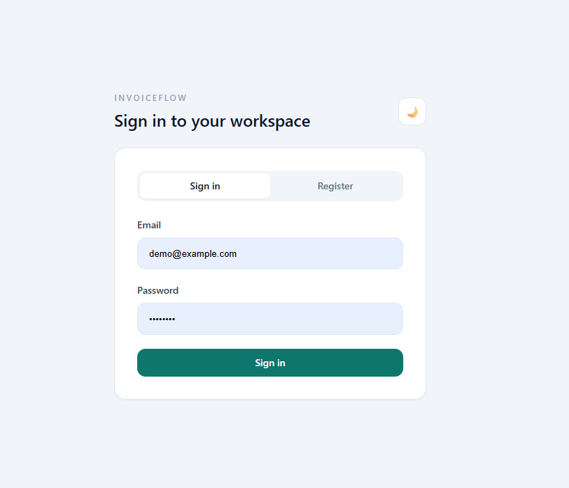
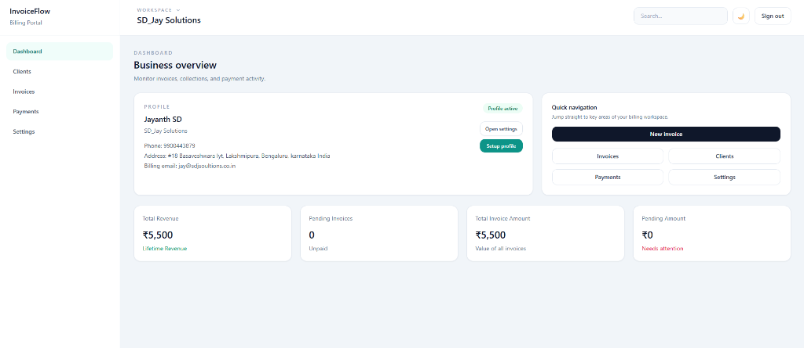
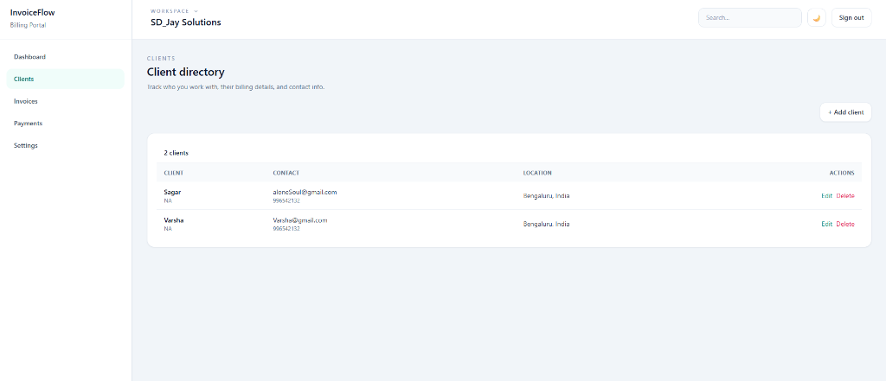
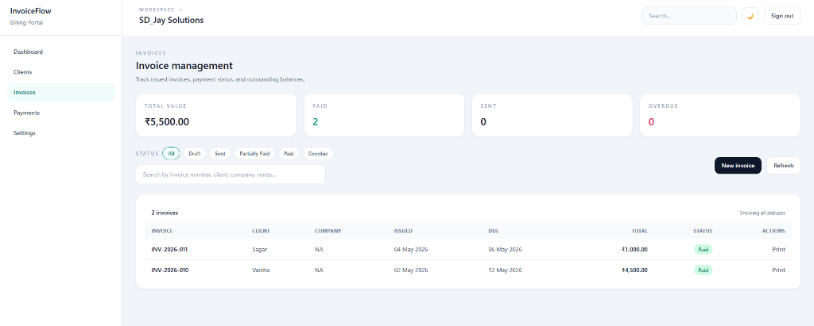
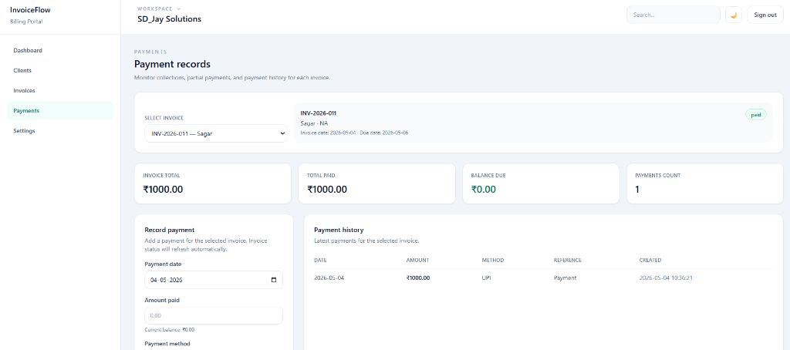
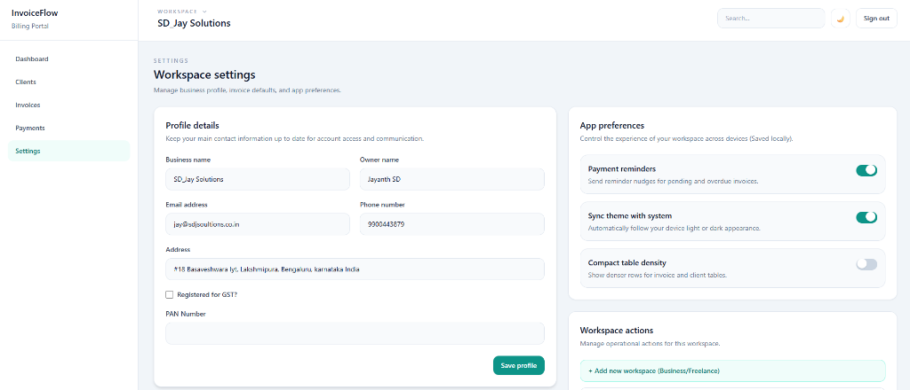

# InvoiceFlow — Professional Billing & Tax Portal

**InvoiceFlow** is a modern, high-performance billing portal designed specifically for freelancers, Kirana stores, and small businesses in India. It simplifies financial management with a premium UI and full compliance with Indian tax regulations.

---

## 🚀 Key Features

### 🏢 Multi-Workspace Management
*   **Dual Profile Support**: Switch seamlessly between **Business** and **Freelance** profiles.
*   **Data Isolation**: Complete separation of clients, invoices, and analytics per workspace.
*   **Real-time Switcher**: Update your entire dashboard context with a single click.

### 🇮🇳 Indian Tax Compliance
*   **GST & HSN/SAC Support**: Built-in fields for GSTIN and HSN/SAC codes for every line item.
*   **Conditional GST Mode**: Automatically hides tax fields for unregistered businesses to keep things simple.
*   **PAN Integration**: Mandatory PAN tracking for business compliance.

### 📄 Professional Invoicing
*   **Tax Invoice Print View**: A clean, industry-standard A4 print layout mirroring traditional Indian tax invoices.
*   **Number-to-Words**: Automatic conversion of grand totals into Indian Rupee words (e.g., *INR Eleven Thousand Eight Hundred Only*).
*   **Smart Print Logic**: Hides portal UI automatically during printing for a pristine physical document.

### 📊 Business Intelligence
*   **Dynamic Dashboard**: Track total revenue, pending payments, and client growth.
*   **Status Tracking**: Manage the lifecycle of invoices from Draft to Paid/Overdue.
*   **Payment History**: Record and track partial or full payments with ease.

---

## 🛠️ Tech Stack

*   **Frontend**: React 19, Tailwind CSS (Vanilla for premium styling), React Router 7.
*   **Backend**: Vanilla PHP (Object-Oriented with PDO), JWT/Session Authentication.
*   **Database**: MySQL (Optimized relational schema).
*   **Design**: Modern Dark/Light mode support with glassmorphic elements.

---

## ⚙️ Installation & Setup

### Prerequisites
*   XAMPP / WAMP / MAMP (Apache & MySQL)
*   Node.js (for frontend development)

### Backend Setup
1.  Move the `backend` folder to your server root (e.g., `C:\xampp\htdocs\invoice-billing-portal`).
2.  Import the database schema from `database/schema.sql` into your PHPMyAdmin.
3.  Configure `backend/config/database.php` with your MySQL credentials.

### Frontend Setup
1.  Navigate to the `frontend` directory.
2.  Run `npm install` to install dependencies.
3.  Run `npm start` to launch the development server.

---

## 📸 Preview

### 🔐 Modern Login Experience

### 📊 Comprehensive Dashboard

### 👥 Client Directory

### 🧾 Invoice Management

### 💰 Payment Records & Tracking

### ⚙️ Workspace, App, Profile, and Business Profile Settings

---

## 🛠️ Built By

This project represents the pinnacle of modern, AI-assisted software engineering, blending human vision with cutting-edge artificial intelligence.

*   **[Jayanth SD](https://github.com/JayanthSD2003) (Lead Architect & Visionary)**:
    Envisioned the core concept of a unified billing portal that scales from freelancers to small businesses. Jayanth directed the high-fidelity UI/UX design, defined the multi-business isolation logic, and oversaw the end-to-end integration of Indian tax compliance laws to ensure the product solves real-world problems for Indian entrepreneurs.

*   **Visual Studio Code (Mission Control)**:
    The backbone of the development workflow. VS Code provided the environment for rapid prototyping, real-time debugging, and code orchestration, enabling the seamless transition between the React frontend and PHP backend.

*   **Thunder Client (API Testing Framework)**:
    Essential for the backend validation phase. Thunder Client was used within VS Code to rigorously test every API endpoint, ensuring that the PHP controllers handled session authentication, data isolation, and tax calculations with 100% accuracy before the frontend was even connected.    

*   **Perplexity AI (Compliance & Research Specialist)**:
    Served as the critical knowledge engine for the project. Perplexity provided deep research and up-to-date information on Indian GST regulations, HSN/SAC code requirements for freelancers, and mandatory invoicing standards. This allowed the team to build a product that is not just functional, but legally compliant for the 2026 tax landscape.

*   **Antigravity by Google DeepMind (Expert Pair Programmer)**:
    Acted as the primary coding intelligence throughout the development lifecycle. Antigravity was responsible for generating complex React state management systems, building robust PHP PDO models, implementing the "Numbers to Words" Indian numbering utility, and optimizing the application for professional A4 printing. It ensured that every line of code was performant, secure, and followed modern best practices.

---

## 📜 License
This project is licensed under the MIT License - see the [LICENSE](LICENSE) file for details.
